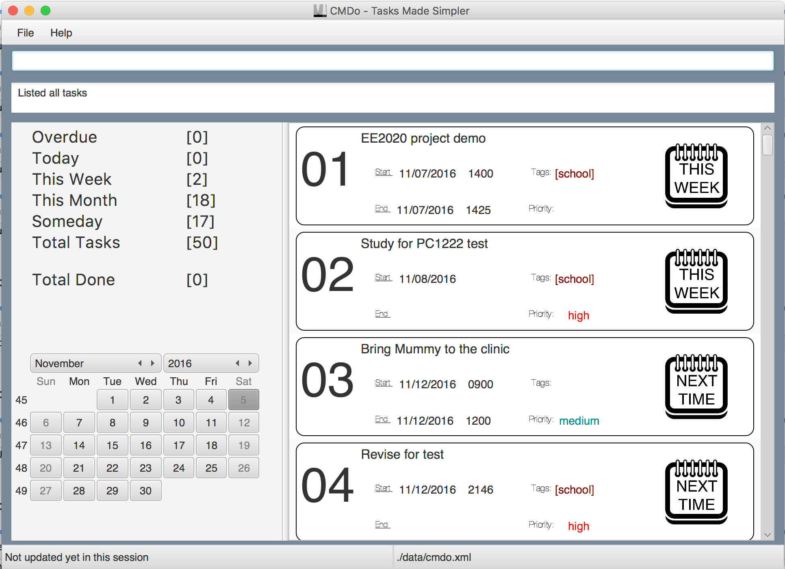
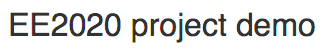
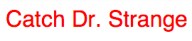
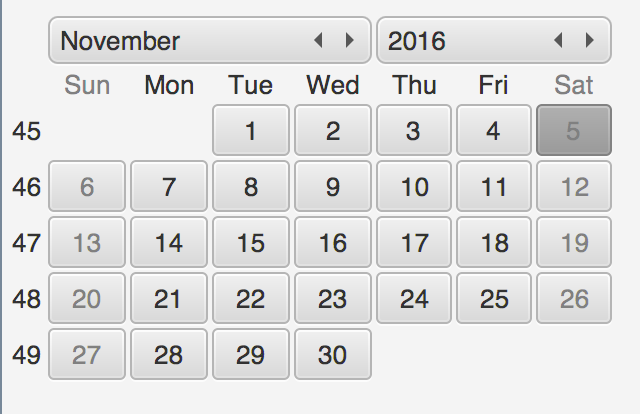
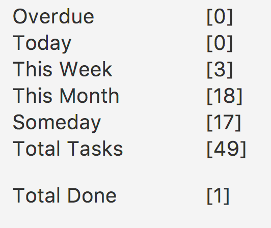

<!-- @@author A0141128R -->
# User Guide

<br><br>

* [Quick Start](#quick-start)
* [Features](#features)
* [FAQ](#faq)
* [Command Summary](#command-summary)

Thanks for using CMDo! Let's get started right away.

## Quick Start

0. Ensure you have Java version `1.8.0_60` or later installed in your computer.
   > Having any Java 8 version is not enough.
   >
   > This app will not work with earlier versions of Java 8.
   
1. Download the latest `CMDo.jar` from the [releases](https://github.com/CS2103AUG2016-F11-C2/main/releases) tab.
2. Copy the file to the folder you want to use as the home folder for your CMDo. A folder `data` will be created to store your task list XML file. You may change this at anytime. Refer to [here](##-`storage`-file-path-may-be-changed).
3. Double-click the JAR file to start the app. The GUI should appear in a few seconds. 

## Orientation

1. Tasks in CMDo are sorted accordingly, hence, tasks that are closest to the deadline will be at the top, as shown below.<br><br>
   <br>
2. Tasks are coded as follows

    #### Text Color
    <br>
    Black: Regular tasks
    
    <br>
    Red: Overdue tasks

    #### Icon
    
    
    
    
    
    
    <br>

    Blocked tasks<br>
    <br>
    Done tasks<br>
    <br>
    
3. Calendar
    Displays from year ### to year #### so you can use CMDo your whole life :) (Rather, you are able to have a quick glance at the months ahead of you)

    <br>

4. Side bar
    Displays cateregories of task with a counter at the side of the number of tasks for each category.
    
    <br>

5. CMDo is a commands-based application. Enter a command in the command box and press <kbd>Enter</kbd> to execute it. <br>
   e.g. typing **`help`** and pressing <kbd>Enter</kbd> will open the help window. 
   
6. Some example commands you can try:
   * **`list all`** : lists all tasks
   * **`add`**` 'email prof damith to feedback on the module on wednesday'` : 
     adds a task named `email prof damith to feedback on module` to your ToDo List.
   * **`delete`**` 1` : deletes the task at index 1 “email prof damith” in the current list
   * **`exit`** : exits the app
7. Refer to the [Features](#features) section below for details of each command.<br>

8. Please remember that when inputting dates into CMDo, you must do so in **MM/DD/YYYY** format. 

# Features

## `add` tasks #LikeASiri

You may add due-by tasks, with relative, explicit or floating date-time inputs. CMDo understands everyday language. Remember that if you are inputting dates, use the **MM/DD/(YYYY)** format.
```
# Due-bys
add 'give me some sugar' tmr at noon                  # relative date and time
add 'give me some coffee' on 10/31/2016 at noon       # explicit date, relative time
add 'give me some candy' on 10/31/2016 at 2230        # explicit date and time
add 'give me some' at 3pm                             # implicit today 
add 'give me some money' tmr                          # floating time
add 'give me'                                         # floating

# Events
add 'give me some sugar' from tmr to 10/31/2016       # you get the idea
```

## `block` time slots #LikeABoss

You may block off time slots to prevent conflicting tasks. Tasks may not be added to the blocked date/time range. Remember that if you are inputting dates, use the **MM/DD/(YYYY)** format.
```
block 'CS2103 exam' tmr                           # entirety of tomorrow is blocked, no tasks may be added inclusive of tomorrow
block 'CS2103 tutorial' from 11am to 12pm         # 11am - 12pm today is blocked, no tasks may be added inclusive of the time range
block 'visit Bolivia' at 11am                     # 11am - 12pm (1h enforced) today is blocked
block 'night of fun' from 10/31 11pm to 11/1 6pm  # 11pm (10/31) - 6pm (11/1) is blocked.
block 12pm                                        # impossible. Secret mission? Give it a name at least.
```

## `done`? Mark them and get on with your life

You may mark a task as `done` at anytime. All you need is the index that the task has on the list.
```
done 1                                  # all done with task 1 (on list)
done give me some                       # invalid
```
Does it make sense to mark a done task as done? No, so don't do it.

## `edit` tasks in the same way

You may edit tasks by first keying in the index of the task in the [list](#List them all). Type in only the fields you are interested in changing. Be warned, in this iteration, you cannot undo an edit. Remember that if you are inputting dates, use the **MM/DD/(YYYY)** format.
```
edit 1 'new name'                 # changes the detail
edit 2 -new tag                   # replaces all tags with `-new` 
edit 3 /medium                    # changes the priority to `medium`
edit 4 tmr at noon                # relative date and time
edit 1                            # actually impossible.
```

## `find` tasks with Power Search (wow)

Are you a goldfish who has about 1,384,103 things to do on your list? You may find tasks using specific keywords! (Add `--done` to search through done tasks) Remember that if you are inputting dates, use the **MM/DD/(YYYY)** format.
```
find word                     # pulls up undone tasks with 'word' in their detail or tag
find high                     # pulls up undone tasks with 'high' in their priority, detail or tag
find tmr 1300                 # pulls up undone tasks with tomorrow's date, 1300 in their date/time parameters 
                                # or 'tmr 1300' in their detail or tag
find --done keyword           # pulls up done tasks with 'keyword' in their detail
find my keys                  # no we don't do that sort of thing

\# Do note todolist understands your spelling errors/ambiguity and will pull out similar tasks for you. 
```

## `list` them all

How do you list tasks, you ask? Super simple!
```
list                                                # lists all undone tasks
list all
la

list done                                           # lists all done tasks
ld

list block                                          # lists all blocked timeslots
lb

ls                                                  # woah woah woah, what are you thinking?
```

## `storage` file path may be changed

You may change the storage file `cmdo.xml`'s location as an when you like.
```
storage                                 # defaults to location data/
storage data/test/cmdo.xml              # valid
storage anywhere/cmdo.xml               # valid
storage anywhere                        # valid (!)
```

## `undo` and `redo` your last action

You may undo and redo add, block, clear, delete, done, edit commands. Basically commands which modify any tasks in the todo list.
```
undo                        # undoes one step
redo                        # redoes one step
```

## `up` and `down`, `top` and `bottom`

You can navigate through CMDo by typing!
```
up
u                           # move up
down
d                           # move down
top
t                           # teleport to the top of the list
bottom
b                           # teleport to the bottom of the list
``` 

## FAQ

**Q**: How do I transfer my data to another Computer?<br>
**A**: Install the app in the other computer and overwrite the empty data file it creates with 
       the file that contains the data of your previous Address Book.
       
**Q**: Is there a click function?<br>
**A**: No

**Q**: How do i customize the functions and commands to suit my style?<br>
**A**: We will have in the next version :)

**Q**: Can i change the layout?<br>
**A**:  We will have in the next version :)

**Q**: How do i set priority to a task?<br>
**A**: add priority under tags eg.(H for high, M for medium, L for low)

**Q**: Is there a cheat sheet for the commands?<br>
**A**: `/help`

**Q**: Do I have to check my to-do list regularly, is there something to remind me?<br>
**A**: You have to check your to-do list, isnt that the point?

**Q**: How do i block out slots for unconfirmed tasks?<br>
**A**: just key in the timming after the task description.

**Q**: How do i see upcoming tasks?<br>
**A**: The list will be sorted according to date and time

**Q**: What do I do with overdue tasks?<br>
**A**: You can either delete them or done them.

**Q**: Why CMDo doesnt just remove my overdue tasks automatically?<br>
**A**: We take into account the fact that you may have been unable to complete it by the set due date but would still need to do so it serves as a reminder.

**Q**: How do scroll up or down the list?<br>
**A**: Use the page up and page down commands, alternatively, use top and bottom commands to for quick access to the top or bottom of the list!

**Q**: This is an interesting product, would I be able to contribute?<br>
**A**: We are open source so feel free to contact us or submit contributions via pull requests!
       
## Command Summary

Command | Format  
-------- | :-------- 
Add | `add '<task>' <day> <time> /<priority> -<tags>`
Delete | `delete <INDEX>`
Done | `done <INDEX>`
Find | `find <keyword>`
List All | `la`
List blocked TimeSlots | `lb`
Help | `help`
Undo | `undo`
Redo | `redo`
Edit | `edit <index> <details to edit>`
Page Up | `up`
Page Down | `down`
Top of list | `top`
Bottom of list | `bottom`
Exit | `exit`

Last updated 7 Nov 2016.
